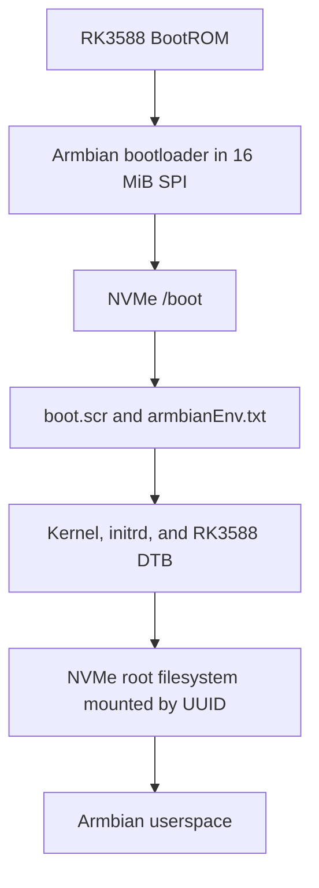

# Process Provenance and Engineering Record

This record documents the experimental path that produced the installation procedure in this repository. It is intended to help other Orange Pi 5 Plus users understand not only the final steps, but also the evidence behind them, the failed paths, and the reasoning used to isolate the working configuration.

## Privacy and sanitization

The public record intentionally omits or replaces:

- usernames and home-directory names;
- hostnames;
- IP addresses and network ranges;
- MAC addresses;
- SSH fingerprints and credentials;
- filesystem UUIDs and partition UUIDs;
- unique SPI-flash hashes;
- account-specific paths and unrelated personal information.

Hardware models, operating-system versions, image filenames, publisher checksums, observed symptoms, and generic device names are retained when they materially improve reproducibility.

## Validation environment

| Item | Validated value |
|---|---|
| Board | Orange Pi 5 Plus |
| SoC | Rockchip RK3588 |
| Memory | 16 GB LPDDR4 |
| NVMe | Nextorage NEM-PA1TB, nominal 1 TB |
| Network during installation | Wired Ethernet |
| Display during installation | HDMI |
| Successful distribution | Armbian 26.5.1, Debian 13 Trixie |
| Successful kernel branch | current |
| Successful kernel | 6.18.33-current-rockchip64 |
| Final architecture | SPI bootloader + NVMe `/boot` + NVMe `/` |
| SD card required after completion | No |

## Tested images

### Successful image

```text
Armbian_26.5.1_Orangepi5-plus_trixie_current_6.18.33_minimal.img.xz
SHA-256:
69aa30cdbcdeb44a8f3fd9f846e2f79b763f3c4c4f963234759ab2236d6090bc
```

This image booted successfully from SD, initialized Ethernet, supported migration of the root filesystem to NVMe, and supported installation of an Armbian bootloader into SPI.

### Failed image retained as evidence

```text
Armbian_26.5.1_Orangepi5-plus_trixie_vendor_6.1.115_minimal.img.xz
SHA-256:
6accbb485f8437920f3b16f0b0f5c49e4dce79374c89e2eab1307f936aaa7377
```

Observed symptoms:

```text
solid red LED
black HDMI output
no Ethernet link/activity
no confirmed user-space startup
```

The exact failure stage was not established because UART output was not available during that test. The evidence supports a branch-specific or early-boot incompatibility on the tested setup; it does not establish that all Armbian vendor images fail on all Orange Pi 5 Plus boards.

### OEM baseline

An Orange Pi Debian image with a 6.1.43 kernel booted successfully from SD and served as a hardware baseline. This showed that the board, SD interface, display path, and Ethernet hardware were capable of booting a compatible image.

## SPI history and interpretation

The board's 16 MiB SPI flash had been zero-filled earlier in the investigation. An SPI snapshot captured after a subsequent OEM boot was therefore classified as:

```text
post-zero-fill, post-OEM-boot snapshot
```

It was not described as a factory backup.

Before installing the Armbian bootloader, all 16 MiB of SPI were read to a file, sized, and hashed. After installation, SPI was read again. Both files were exactly 16 MiB and had different hashes, proving that the bootloader update changed SPI. Exact unique SPI hashes are intentionally omitted from this public record.

## Chronological engineering record

### Phase 1 — Establish a working non-OEM Armbian boot

1. Downloaded and verified an official Armbian current-kernel minimal image.
2. Wrote the image to SD.
3. Booted the Orange Pi 5 Plus successfully.
4. Verified:
   - Linux 6.18.33;
   - Debian 13 Trixie;
   - wired Ethernet;
   - SSH access;
   - NVMe visibility.

**Finding:** The board was not restricted to Orange Pi-supplied operating systems. A standard Armbian image could boot successfully.

### Phase 2 — Move the root filesystem to NVMe

1. Ran `armbian-install`.
2. Selected the workflow labeled similar to:

   ```text
   Boot from SD - system on SATA, USB or NVMe
   ```

3. Selected the NVMe destination and ext4.
4. Rebooted with the SD card still installed.
5. Verified that `/` mounted from the NVMe partition.

The intermediate storage design was:

```text
SPI: unchanged
SD: bootloader and /boot
NVMe: /
```

This configuration worked and booted in approximately 26 seconds, but the SD card remained mandatory.

### Phase 3 — Preserve and update SPI

1. Read all 16 MiB from `/dev/mtd0`.
2. Verified the file size and recorded a checksum.
3. Ran `armbian-install`.
4. Initially selected the combined workflow labeled similar to:

   ```text
   Boot from MTD Flash - system on SATA, USB or NVMe
   ```

5. The installer proposed the SD card as a target. That operation was cancelled to avoid erasing the working recovery/boot medium.
6. Returned to the main menu and selected the standalone operation labeled similar to:

   ```text
   Install/Update the bootloader on MTD Flash
   ```

7. The SPI write completed.
8. Read SPI again and proved that its contents changed.

**Key lesson:** Menu numbers are not stable, and a combined migration option may select an unintended target when the root filesystem has already been moved. Read the descriptive labels and every destination prompt.

### Phase 4 — First NVMe-only test and controlled failure

1. Powered down.
2. Removed the SD card.
3. Performed a cold boot.

Observed:

```text
solid red LED
black HDMI output
no Ethernet link/activity
```

The SD card was reinserted and the system booted immediately.

This proved:

- the SPI update had not destroyed SD boot;
- the NVMe root filesystem remained valid;
- the failure was specific to the SD-free boot path.

### Phase 5 — Identify the hidden missing `/boot`

The working system showed:

```text
/       -> NVMe
/boot   -> bind mount from SD:/boot
```

Listing `/boot` and the SD mount showed identical files because both paths referred to the SD card. To inspect the NVMe root filesystem's underlying `/boot`, `/` was bind-mounted at a second location:

```bash
sudo mount --bind / /mnt/nvme-root-view
```

The underlying NVMe directory was then visible as:

```text
/mnt/nvme-root-view/boot
```

It was empty.

**Root cause:** The SPI bootloader had no kernel, initrd, device tree, boot script, or `armbianEnv.txt` to load from NVMe. The failed NVMe-only test was therefore expected.

### Phase 6 — Complete the NVMe boot tree

The complete working SD `/boot` tree was copied to the underlying NVMe `/boot` with metadata-preserving `rsync`.

The copied `armbianEnv.txt` was checked to ensure that `rootdev=UUID=...` referenced the NVMe root filesystem.

Required boot artifacts were verified:

```text
Image
uInitrd
boot.scr
armbianEnv.txt
dtb/rockchip/rk3588-orangepi-5-plus.dtb
```

### Phase 7 — Remove SD dependencies from `/etc/fstab`

The migration-generated `/etc/fstab` contained:

```text
SD partition -> /media/mmcboot
/media/mmcboot/boot -> /boot (bind mount)
NVMe partition -> /
```

The two SD-dependent entries were commented out, leaving only the NVMe root and intended pseudo-filesystems active.

`findmnt --verify --verbose` completed with no errors or warnings.

### Phase 8 — Successful cold NVMe-only boot

1. Powered down.
2. Disconnected power.
3. Removed the SD card.
4. Cold-booted from SPI and NVMe.

The board booted successfully.

Final verification established:

```text
/dev/nvme0n1p1 mounted as /
/boot is part of the NVMe root filesystem
no mmcblk device present
no active SD entries in /etc/fstab
no failed systemd units
```

Measured boot time:

```text
kernel:    3.727 seconds
userspace: 2.576 seconds
total:     6.303 seconds
```

## Proven final boot chain



## Evidence-supported conclusions

1. The Orange Pi 5 Plus can boot an official non-OEM Armbian current-kernel image.
2. Moving `/` to NVMe does not necessarily move `/boot`.
3. Installing an SPI bootloader does not compensate for an empty NVMe `/boot`.
4. A working SD-assisted NVMe system can be converted to SD-free operation by:
   - installing the appropriate SPI bootloader;
   - copying the complete boot tree to NVMe;
   - confirming the NVMe root UUID in `armbianEnv.txt`;
   - removing SD mount dependencies from `/etc/fstab`.
5. The known-good SD card remains a valuable recovery mechanism and should be preserved unchanged.
6. Failed images and failed boot attempts should be retained as evidence rather than silently discarded.

## Limits of this validation

- Only one physical board was used.
- Only the listed images and kernel branches were directly tested.
- UART output was not available for the failed vendor-kernel image.
- Desktop environments, dual-monitor support, and Mali GPU acceleration were not part of this boot-storage validation.
- Future Armbian releases may change installer labels, menu ordering, boot scripts, partitioning behavior, or kernel support.

## Reproduction standard

A reproduction should record:

- board revision and memory size;
- NVMe model;
- exact Armbian image filename;
- published image checksum;
- kernel version;
- installer option labels;
- pre- and post-operation mount tables;
- whether `/boot` is a separate mount or part of NVMe root;
- sanitized final verification output;
- failure symptoms and UART output when available.

Do not publish unique account, network, filesystem, or device identifiers.
