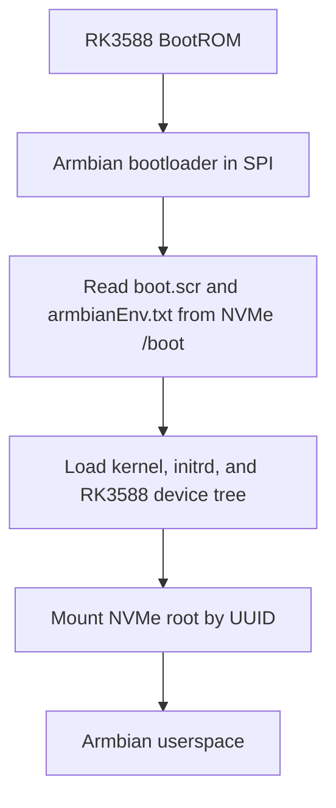

# orange-pi-5-plus-armbian-spi-nvme
Install Armbian native images on Orange Pi 5 Plus. Includes Installation instructions as well as troubleshooting process, issues and findings from my adventure installing on this hardware. 
# Orange Pi 5 Plus: Installing Armbian for Full SPI + NVMe Boot

> A tested, evidence-driven procedure for installing Armbian on an Orange Pi 5 Plus so that the board boots from its SPI flash and runs entirely from an NVMe SSD, with no SD card required after installation.

**Last validated:** 2026-07-17  
**Board:** Orange Pi 5 Plus (Rockchip RK3588)  
**Validated operating system:** Armbian 26.5.1, Debian 13 (Trixie), Minimal/CLI, **current** kernel 6.18.33  
**Final storage layout:** bootloader in SPI flash; `/boot` and `/` on NVMe

---

## 1. Scope and result

This guide starts with an Armbian image written to an SD card and ends with this boot path:

```text
┌──────────────────────┐
│ RK3588 BootROM       │
│ Built into the SoC   │
└──────────┬───────────┘
           │ reads boot firmware
           ▼
┌──────────────────────┐
│ 16 MiB SPI flash     │
│ Armbian bootloader   │
└──────────┬───────────┘
           │ loads boot.scr, kernel,
           │ initrd, and DTB
           ▼
┌──────────────────────┐
│ NVMe SSD             │
│ /boot                │
│ /                    │
└──────────┬───────────┘
           │
           ▼
┌──────────────────────┐
│ Armbian Linux        │
│ No SD card required  │
└──────────────────────┘
```

A successful final system should show:

- no `mmcblk` device when the SD card is removed;
- the NVMe partition mounted as `/`;
- `/boot` as a normal directory on the NVMe root filesystem;
- an Armbian bootloader stored in SPI flash;
- no SD-card entries active in `/etc/fstab`.

---

## 2. Important findings from testing

> [!IMPORTANT]
> Installing the root filesystem on NVMe is **not sufficient** for SD-free boot. In the tested migration, Armbian left `/boot` on the SD card and placed only `/` on NVMe. Removing the SD card therefore removed the kernel, initrd, DTB, and boot script.

> [!IMPORTANT]
> The working solution required all three of these conditions:
>
> 1. Armbian bootloader installed in SPI flash;
> 2. a complete `/boot` tree copied onto the NVMe root filesystem;
> 3. SD-dependent `/etc/fstab` entries disabled.

> [!WARNING]
> The `armbian-install` menu numbers can change. Select options by their **text labels**, not by number.

> [!WARNING]
> When the system is already running with `/` on NVMe and `/boot` on SD, the combined option labeled similar to **“Boot from MTD Flash — system on SATA, USB or NVMe”** may propose the SD card as the installation target. Do not approve a destination that would erase the working SD card. Use the separate **“Install/Update the bootloader on MTD Flash”** operation instead.

> [!NOTE]
> On the tested board, an Armbian image from the **current** kernel branch booted successfully, while a tested **vendor** 6.1.x image produced a black display, solid red LED, and no Ethernet. That is a result from one board/image combination, not proof that every vendor image is defective. If one branch fails before networking or video initializes, test another official branch before modifying SPI.

---

## 3. References

- [Armbian Orange Pi 5 Plus download page](https://armbian.com/boards/orangepi5-plus)
- [Armbian installation documentation](https://docs.armbian.com/User-Guide_Getting-Started/)
- [Armbian troubleshooting and recovery documentation](https://docs.armbian.com/User-Guide_Troubleshooting/)

Armbian documents installation scenarios including SD boot with a system on NVMe, SPI boot with a system on NVMe, and separate SPI bootloader installation.

---

## 4. Required hardware

- Orange Pi 5 Plus
- suitable USB-C power supply for the board and attached devices
- microSD card, preferably 16 GB or larger
- NVMe SSD compatible with the board
- Ethernet connection strongly recommended for initial setup
- HDMI display and keyboard, or a known way to discover the DHCP address and connect by SSH
- another Linux computer for downloading, verifying, and writing the SD image

Recommended recovery/debugging equipment:

- USB-to-TTL serial adapter compatible with the board's UART voltage
- second microSD card
- reliable card reader

> [!WARNING]
> Inadequate power can resemble storage or bootloader failure. Use a power supply and cable appropriate for the Orange Pi 5 Plus, especially with NVMe installed.

---

## 5. Choose and download an Armbian image

Open the official Orange Pi 5 Plus page and choose an official image appropriate for the intended use.

For the validated procedure, the successful image was:

```text
Armbian 26.5.1
Debian 13 (Trixie)
Minimal / CLI
current kernel 6.18.33
```

Image names and kernel versions will change over time. Record the exact filename and its published checksum.

Example variables:

```bash
IMAGE_XZ='Armbian_<version>_Orangepi5-plus_<release>_current_<kernel>_minimal.img.xz'
CHECKSUM_FILE="${IMAGE_XZ}.sha"
```

### Verify the downloaded image

Use the checksum published beside the image on the Armbian download page.

```bash
sha256sum "$IMAGE_XZ"
```

Compare the result character-for-character with the published value.

> [!WARNING]
> Do not skip image verification. A corrupted download can produce exactly the same symptoms as an incompatible bootloader: black screen, no Ethernet, and no useful diagnostic output.

---

## 6. Write the SD card

Armbian recommends Armbian Imager. A Linux command-line method is also shown below.

### 6.1 Identify the SD device carefully

Before inserting the card:

```bash
lsblk -o NAME,PATH,SIZE,MODEL,TRAN,TYPE,MOUNTPOINTS
```

Insert the card and run the same command again. Identify the whole device, such as `/dev/sdX`, **not** a partition such as `/dev/sdX1`.

```bash
SD_DEVICE=/dev/sdX
```

> [!CAUTION]
> The next operation destroys all data on the selected device. A wrong value can erase the host computer's system disk.

Unmount automatically mounted SD partitions:

```bash
sudo umount "${SD_DEVICE}"?* 2>/dev/null || true
```

Write the compressed image:

```bash
xzcat "$IMAGE_XZ" | sudo dd of="$SD_DEVICE" bs=16M oflag=direct status=progress
sync
```

Remove and reinsert the card, then confirm partitions are visible:

```bash
lsblk -f "$SD_DEVICE"
```

### 6.2 Optional byte-level verification

```bash
unxz -k "$IMAGE_XZ"
IMAGE_FILE=${IMAGE_XZ%.xz}
IMAGE_SIZE=$(stat -c '%s' "$IMAGE_FILE")

sudo cmp -n "$IMAGE_SIZE" "$IMAGE_FILE" "$SD_DEVICE"
echo "cmp_exit=$?"
```

Expected:

```text
cmp_exit=0
```

---

## 7. First boot from SD

1. Power the board off.
2. Install the NVMe SSD.
3. Insert the written SD card.
4. Connect Ethernet and a display if available.
5. Apply power.
6. Allow extra time for the first boot.

Complete Armbian's first-login setup and create an administrative user.

Verify:

```bash
uname -a
cat /etc/os-release
lsblk -o NAME,PATH,SIZE,TYPE,FSTYPE,LABEL,UUID,PARTUUID,MOUNTPOINTS,MODEL
ip -brief address
```

Expected:

- root filesystem on SD;
- NVMe visible as `/dev/nvme0n1`;
- working Ethernet or local console.

> [!NOTE]
> If an official image shows only a solid red LED, black display, and no Ethernet after several minutes, preserve the failed image details and checksum. Before changing SPI, try a different official kernel branch and, when possible, collect UART output.

---

## 8. Update packages before migration

```bash
sudo apt update
sudo apt full-upgrade
sudo reboot
```

After reboot:

```bash
uname -a
systemctl --failed --no-legend
```

Resolve unexpected errors before continuing.

---

## 9. Migrate the root filesystem to NVMe

Run:

```bash
sudo armbian-install
```

Choose the option labeled similar to:

```text
Boot from SD - system on SATA, USB or NVMe
```

Then:

- select the NVMe drive/partition as the destination;
- use `ext4` unless another filesystem is intentionally required;
- allow the installer to copy the system;
- do not interrupt power.

> [!WARNING]
> Read every destination prompt. Confirm that the selected destination is the NVMe device, normally `/dev/nvme0n1` or `/dev/nvme0n1p1`, and not the SD card.

Reboot with the SD card still inserted:

```bash
sudo reboot
```

Verify that `/` is now on NVMe:

```bash
findmnt -no SOURCE,TARGET,FSTYPE,OPTIONS /
lsblk -o NAME,PATH,SIZE,TYPE,FSTYPE,LABEL,UUID,PARTUUID,MOUNTPOINTS,MODEL
cat /proc/cmdline
cat /etc/fstab
```

A common intermediate arrangement is:

```text
Power on
   │
   ▼
SD bootloader ──► SD /boot ──► kernel/initrd/DTB
                                  │
                                  ▼
                              NVMe root /
```

This is **not yet SD-free**.

---

## 10. Preserve the existing SPI flash

Confirm the MTD device:

```bash
ls -l /dev/mtd0 /dev/mtdblock0
cat /proc/mtd
```

Create a working directory:

```bash
mkdir -p "$HOME/nvme-boot-migration"
cd "$HOME/nvme-boot-migration"
```

Back up SPI:

```bash
sudo dd if=/dev/mtd0   of=spi-before-armbian-bootloader.bin   bs=1M   status=progress

sudo chown "$USER:$USER" spi-before-armbian-bootloader.bin
stat -c 'size_bytes=%s file=%n' spi-before-armbian-bootloader.bin
sha256sum spi-before-armbian-bootloader.bin   | tee spi-before-armbian-bootloader.sha256
```

For a 16 MiB SPI device, expected size:

```text
16777216 bytes
```

> [!WARNING]
> This snapshot is a backup of the SPI's **current state**, not necessarily a factory image. Label it with the date and known board history.

Copy the backup and checksum to another computer before writing SPI.

---

## 11. Install the Armbian bootloader into SPI

Run:

```bash
sudo armbian-install
```

Choose the separate option labeled similar to:

```text
Install/Update the bootloader on MTD Flash
```

> [!CAUTION]
> Do not interrupt power during the SPI write.

> [!WARNING]
> Do not use a combined install option if it proposes wiping or installing onto the SD card. Cancel and use the standalone MTD bootloader update option.

After completion, read SPI again:

```bash
cd "$HOME/nvme-boot-migration"

sudo dd if=/dev/mtd0   of=spi-after-armbian-bootloader.bin   bs=1M   status=progress

sudo chown "$USER:$USER" spi-after-armbian-bootloader.bin

stat -c 'size_bytes=%s file=%n' spi-after-armbian-bootloader.bin
sha256sum spi-before-armbian-bootloader.bin           spi-after-armbian-bootloader.bin

cmp -s spi-before-armbian-bootloader.bin        spi-after-armbian-bootloader.bin
echo "cmp_exit=$?"
```

Expected:

```text
Both files are 16777216 bytes
Their SHA-256 hashes differ
cmp_exit=1
```

`cmp_exit=1` is expected: it proves SPI changed.

---

## 12. Why SPI installation alone may not boot NVMe

An SD-free attempt may still show:

```text
solid red LED
black HDMI output
no Ethernet LEDs
```

The bootloader may be running but unable to find the kernel because the NVMe's underlying `/boot` directory is empty.

While SD is mounted at `/boot`, a normal `ls /boot` shows SD files and hides the NVMe root filesystem's own `/boot` directory:

```text
Visible:
  /boot ─────────────► SD:/boot

Hidden underneath:
  NVMe:/boot          possibly empty
```

---

## 13. Inspect the hidden NVMe `/boot`

```bash
sudo mkdir -p /mnt/nvme-root-view
sudo mount --bind / /mnt/nvme-root-view
```

Inspect:

```bash
findmnt /mnt/nvme-root-view
sudo ls -lah /mnt/nvme-root-view/boot
```

If it is empty or lacks `Image`, `uInitrd`, `boot.scr`, and the device tree, continue.

---

## 14. Copy the complete boot tree onto NVMe

With `/boot` showing the working SD files and `/mnt/nvme-root-view/boot` showing the underlying NVMe directory:

```bash
sudo rsync -aHAX --numeric-ids   /boot/   /mnt/nvme-root-view/boot/

sync
```

Inspect:

```bash
sudo ls -lah /mnt/nvme-root-view/boot
sudo cat /mnt/nvme-root-view/boot/armbianEnv.txt
```

Discover the NVMe root UUID dynamically:

```bash
NVME_ROOT_UUID=$(findmnt -no UUID /)
printf 'NVMe root UUID: %s
' "$NVME_ROOT_UUID"
```

Expected in `armbianEnv.txt`:

```text
rootdev=UUID=<NVME_ROOT_UUID>
rootfstype=ext4
```

Correct it if required:

```bash
sudo sed -i   "s|^rootdev=.*|rootdev=UUID=${NVME_ROOT_UUID}|"   /mnt/nvme-root-view/boot/armbianEnv.txt
```

Validate required files:

```bash
sudo test -e /mnt/nvme-root-view/boot/Image &&
sudo test -e /mnt/nvme-root-view/boot/uInitrd &&
sudo test -f /mnt/nvme-root-view/boot/boot.scr &&
sudo test -f /mnt/nvme-root-view/boot/dtb/rockchip/rk3588-orangepi-5-plus.dtb &&
echo 'PASS: NVMe boot files present'
```

> [!NOTE]
> `Image`, `uInitrd`, and `dtb` are normally symbolic links. `test -e` is suitable for validating links.

---

## 15. Remove SD dependencies from `/etc/fstab`

Back up the file:

```bash
sudo cp -a /etc/fstab   "/etc/fstab.before-nvme-only-$(date +%Y%m%d-%H%M%S)"
```

Typical SD-assisted entries resemble:

```text
UUID=<SD_UUID>       /media/mmcboot  ext4  ...  0 1
/media/mmcboot/boot  /boot           none  bind 0 0
UUID=<NVME_UUID>     /               ext4  ...  0 1
```

Comment out the SD mount and `/boot` bind mount by mount point:

```bash
sudo awk '
  $2 == "/media/mmcboot" {
    print "# NVME-ONLY: " $0
    next
  }
  $1 == "/media/mmcboot/boot" && $2 == "/boot" {
    print "# NVME-ONLY: " $0
    next
  }
  { print }
' /etc/fstab | sudo tee /etc/fstab.new >/dev/null

sudo mv /etc/fstab.new /etc/fstab
sudo chmod 644 /etc/fstab
sudo systemctl daemon-reload
```

Verify:

```bash
echo '===== ACTIVE FSTAB ENTRIES ====='
grep -vE '^[[:space:]]*(#|$)' /etc/fstab

echo '===== FSTAB VALIDATION ====='
sudo findmnt --verify --verbose
```

Expected:

```text
Success, no errors or warnings detected
```

> [!WARNING]
> Do not remove the SD card until the NVMe `/boot` tree is complete and `/etc/fstab` no longer requires the SD card.

Unmount the temporary view:

```bash
sudo umount /mnt/nvme-root-view
```

---

## 16. First cold NVMe-only boot

Shut down:

```bash
sudo poweroff
```

Then:

1. wait until fully off;
2. disconnect power;
3. remove the SD card;
4. leave NVMe installed;
5. wait about 30 seconds;
6. connect Ethernet and one HDMI display;
7. apply power;
8. allow up to three minutes.



---

## 17. Final verification

```bash
echo '===== ROOT ====='
findmnt -no SOURCE,TARGET,FSTYPE,OPTIONS /

echo
echo '===== BOOT ====='
findmnt /boot || echo '/boot is part of the NVMe root filesystem'

echo
echo '===== STORAGE ====='
lsblk -o NAME,PATH,SIZE,TYPE,FSTYPE,LABEL,UUID,PARTUUID,MOUNTPOINTS,MODEL

echo
echo '===== CMDLINE ====='
cat /proc/cmdline

echo
echo '===== FSTAB ====='
grep -vE '^[[:space:]]*(#|$)' /etc/fstab

echo
echo '===== BOOT TIME ====='
systemd-analyze

echo
echo '===== FAILED UNITS ====='
systemctl --failed --no-legend
```

Success criteria:

```text
[PASS] / is mounted from the intended NVMe partition
[PASS] no mmcblk device is present with SD removed
[PASS] /boot is not a separate SD-backed mount
[PASS] root=UUID= points to the NVMe root filesystem
[PASS] /etc/fstab has no active SD dependency
[PASS] no unexpected failed systemd units
```

Final architecture:

```text
┌──────────────┐     ┌─────────────────┐     ┌────────────────────┐
│ RK3588 ROM   │ ──► │ SPI bootloader  │ ──► │ NVMe /boot         │
└──────────────┘     └─────────────────┘     │ boot.scr            │
                                             │ armbianEnv.txt       │
                                             │ kernel + initrd      │
                                             │ device tree          │
                                             └─────────┬──────────┘
                                                       │
                                                       ▼
                                             ┌────────────────────┐
                                             │ NVMe root /        │
                                             │ Armbian userspace  │
                                             └────────────────────┘
```

---

## 18. Recovery strategy

Keep the working SD card unchanged and label it as a recovery medium.

Preserve:

```text
spi-before-armbian-bootloader.bin
spi-before-armbian-bootloader.sha256
spi-after-armbian-bootloader.bin
SHA-256 values for both files
exact Armbian image filename and checksum
```

### If NVMe-only boot fails

1. power off and disconnect power;
2. reinsert the known-good SD card;
3. boot with SD and NVMe installed;
4. confirm whether `/` still mounts from NVMe;
5. inspect the underlying NVMe `/boot`;
6. validate `armbianEnv.txt`, `boot.scr`, DTB path, and `/etc/fstab`;
7. obtain UART logs before further SPI changes.

### If SD recovery also fails after an SPI update

Do not repeatedly write random bootloader images. Use UART to identify the last completed boot stage and prepare a documented SPI restore procedure from the saved snapshot.

> [!CAUTION]
> Restoring a raw SPI image is destructive and should only be attempted with a verified backup, stable power, and a recovery path.

---

## 19. Updating safely

Because `/boot` is now on NVMe, normal kernel package updates should update the correct boot tree.

```bash
sudo apt update
sudo apt full-upgrade
sudo reboot
```

Then verify:

```bash
uname -a
ls -lah /boot
systemctl --failed --no-legend
```

To update SPI intentionally:

```bash
sudo armbian-install
```

Choose:

```text
Install/Update the bootloader on MTD Flash
```

Create a new dated SPI snapshot first.

---

## 20. Troubleshooting matrix

| Symptom | Likely area | Recommended next check |
|---|---|---|
| Solid red LED, black screen, no Ethernet when booting SD | image, SD write, kernel branch, early boot | verify checksum and card write; try another official branch; capture UART |
| Boots with SD but not without it after SPI installation | NVMe `/boot` absent or incomplete | inspect hidden NVMe `/boot` through bind mount |
| Reaches Linux but waits for a missing device | stale SD entry in `/etc/fstab` | run `findmnt --verify`; disable SD mount and bind mount |
| SPI changed, but SD boot still works | SD may still be supplying `/boot` | copy `/boot` to NVMe and remove SD dependency |
| Root mounts from NVMe, but `findmnt /boot` shows SD | intermediate SD-assisted configuration | complete Sections 13–16 |
| NVMe is not visible in Linux | hardware, seating, power, PCIe/NVMe support | reseat SSD; inspect `dmesg`; verify power |
| Boot succeeds but no display | display initialization or kernel branch | test Ethernet/SSH; inspect DRM logs; try another HDMI port/display |

Useful diagnostics:

```bash
dmesg -T | grep -Ei 'nvme|pcie|mtd|spi|mmc|drm|hdmi|error|fail'
journalctl -b -p warning
ls -l /dev/disk/by-uuid/
findmnt --verify --verbose
```

---

## 21. Sanitization and publication notes

Before publishing logs, remove or replace:

- usernames and home-directory names;
- hostnames;
- IP addresses and network ranges;
- MAC addresses;
- Wi-Fi SSIDs and credentials;
- SSH keys and fingerprints;
- machine-specific filesystem UUIDs and PARTUUIDs;
- serial numbers or purchase identifiers unless technically relevant.

Use placeholders such as:

```text
<USER>
<HOSTNAME>
<IP_ADDRESS>
<MAC_ADDRESS>
<SD_UUID>
<NVME_ROOT_UUID>
```

This document intentionally contains no private username, IP address, MAC address, or machine-specific filesystem UUID from the validation system.

---

## 22. Condensed checklist

```text
[ ] Download official Orange Pi 5 Plus Armbian image
[ ] Verify published checksum
[ ] Write and optionally byte-verify SD card
[ ] Boot Armbian from SD
[ ] Verify NVMe is visible
[ ] Update packages
[ ] Use armbian-install: Boot from SD, system on NVMe
[ ] Reboot and prove / is on NVMe
[ ] Back up all 16 MiB of SPI and hash it
[ ] Use armbian-install: Install/Update bootloader on MTD Flash
[ ] Read SPI again and prove it changed
[ ] Bind-mount / to expose the underlying NVMe /boot
[ ] Copy the complete working /boot tree from SD to NVMe
[ ] Confirm armbianEnv.txt points to the NVMe root UUID
[ ] Disable SD and /boot bind entries in /etc/fstab
[ ] Validate fstab with findmnt --verify
[ ] Power off, remove SD, and cold boot
[ ] Verify NVMe-only root and boot configuration
[ ] Preserve recovery SD, SPI snapshots, image name, and checksums
```

---

## 23. Proven outcome

```text
PASS — Orange Pi 5 Plus boots Armbian directly through SPI + NVMe
PASS — SD card removed
PASS — kernel, initrd, DTB, and boot configuration loaded from NVMe
PASS — root filesystem mounted from NVMe by UUID
PASS — no active SD dependency in /etc/fstab
PASS — no failed systemd units
```
